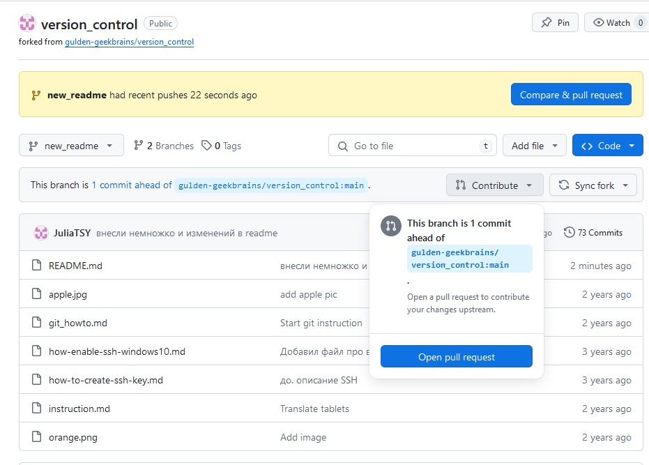

# Это репозиторий для обучения pull request

## Первые шаги

1. Делаем fork репозитория, в которой потом хотим сделать pull request. Ищем кнопку Fork на странице репозитория <https://git@github.com:gulden-geekbrains/version_control.git>
2. Выполняем команду клонирования из своей fork-копии
```sh
git clone git@github.com:*YOURE_GITHUB*/version_control.git
```

3. Создаем новую ветку 
```sh
git checkout -b updatereadme

__И вносим необходимые изменения в файл__

vim README.md
git add README.md
git commit -m "Добавили инструкцию как создать pull request"
```
4. Делаем push  
```sh
git push --set-upstream origin updatereadme
```
5. Переходим на свою страницу репозитория. Выбираем ветку **updatereadme** и жмем кнопку **Compare & pull request**

У меня другая кнопка в вебе:




## Заметки

Что бы сделать push от другого пользователя необходимо выполнить команду
```sh
GIT_SSH_COMMAND='ssh -i ~/.ssh/user-private-key -o IdentitiesOnly=yes' git push git@github.com:gulden-geekbrains/version_control.git
```

вместо *user-private-key* подставьте свой ключ

Можно прописать настройки для подсоединения по ssh
```sh
git config remote.origin.url git@github.com:gitusername/reponame
git config core.sshCommand "ssh -i ~/.ssh/user-private-key -o IdentitiesOnly=yes"
```
# Как подружить git с github под Windows 10

Вот видео инструкция https://youtu.be/E8cIjbJMEpE


## Краткий список необходимых команд
Создать репозиторий — **git init**. Инициализирует пустой репозиторий.

Склонировать удалённый репозиторий — **git clone** [ссылка на удалённый репозиторий]. Проект появится в директории, где вы находились в момент клонирования.

Подтянуть изменения — **git pull** . Подтягивает в локальный репозиторий последнюю версию проекта. 

Посмотреть статус файлов — **git status**. Вы увидите, какие файлы изменили, удалили или добавили в проект. 

Добавить файлы в индекс — **git add** [название файла]. После ввода этой команды вы можете сделать коммит.

Сделать коммит — **git commit -m "Комментарий к коммиту"** — фиксирует изменения. До выполнения этой команды локальные изменения никуда не запишутся.

Посмотреть историю коммитов — **git log**. Выводит список всех коммитов. У этой команды есть разные опции, самая используемая из них — **--oneline**.

Запушить изменения — **git push**. Отправляет все зафиксированные изменения с локального репозитория в удалённый. Это одна из самых важных команд, ведь все вышеописанные действия производятся в локальной копии репозитория. Когда вы закончите работу, эту копию нужно будет отправить в удалённый репозиторий. Только так другие участники процесса смогут получить актуальную версию.